# LUỒNG 1: AUTO ASSIGNMENT (PHÂN CÔNG TỰ ĐỘNG)

## Màn 1: Quản lý nhân sự (/personnel)
- **Chú ý:** 5 nhân viên chủ chốt (Bùi Mạnh Hà, Đỗ Quốc Huy...) đang ở trạng thái ĐANG LÀM VIỆC.
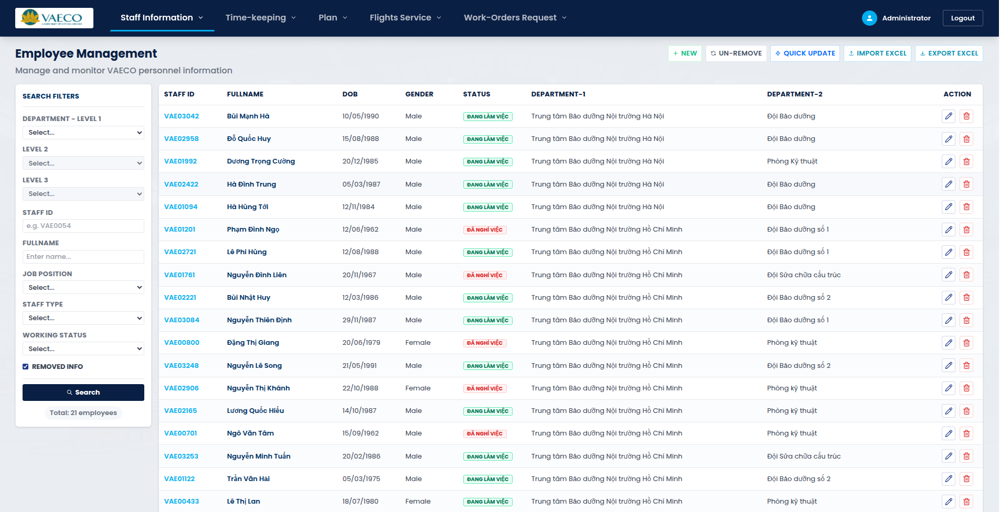

## Màn 2: Quản lý chứng chỉ (/certificates)
- **Chú ý:** Cả 5 người đều có chứng chỉ phù hợp cho máy bay A-350. Riêng Bùi Mạnh Hà có thêm 1 chứng chỉ đặc thù cho Work Order.
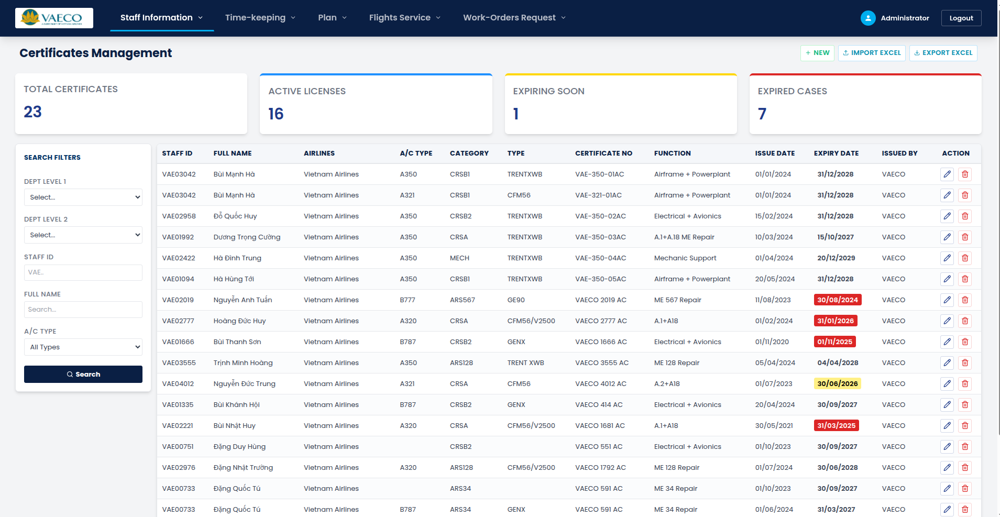

## Màn 3: Phân ca (/rostering)
- **Chú ý:** Ngày 18/06/2026, cả 5 người đều đi Ca Sáng (CS).
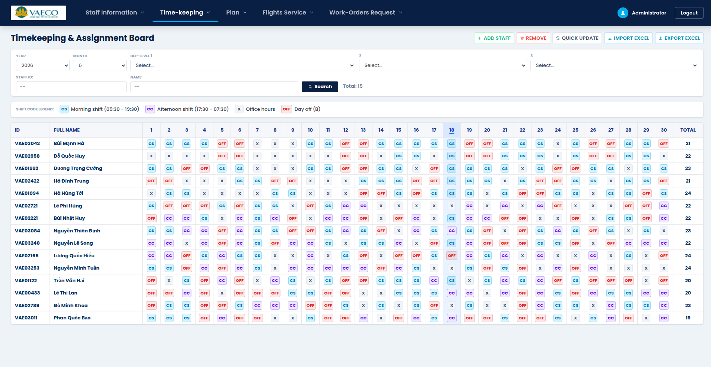

## Màn 4: Kế hoạch tổng thể (/master-plan)
- **Chú ý:** Thấy bản ghi kế hoạch Ca Sáng (CS) ngày 18/06/2026.
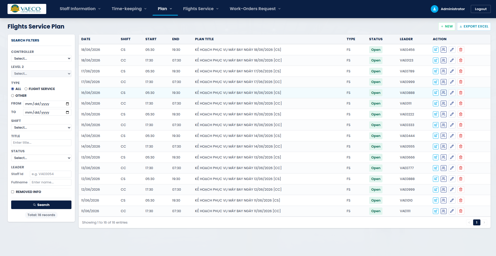

## Màn 5: Chi tiết phân công (/master-plan/manpower/1)
- **Bước làm:** Nhấn nút Add to plan (Hệ thống đã tự động chọn sẵn các nhân viên phù hợp).
- **Chú ý:** Tab VNA - CRSA/B sáng lên và hiển thị số lượng là 5.
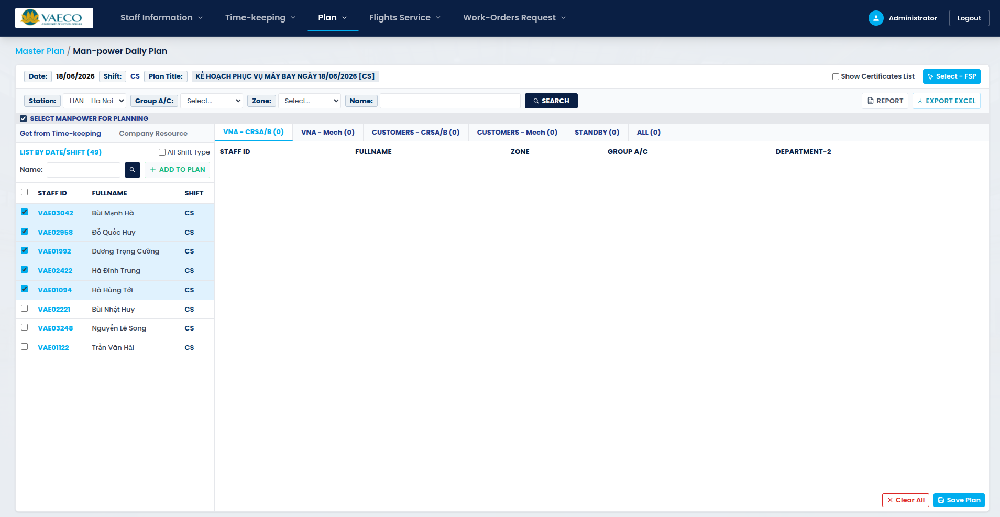
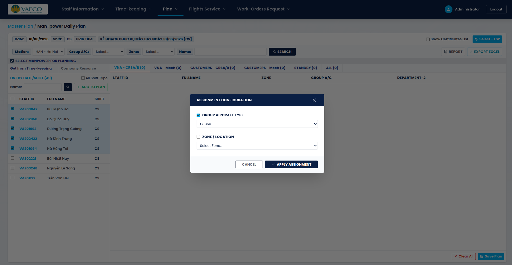
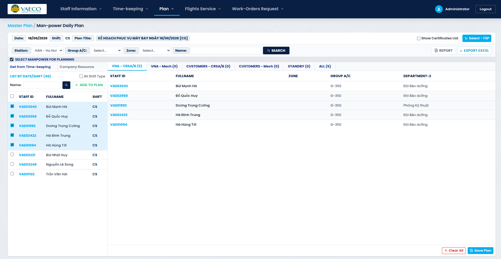

## Màn 6: Lịch bay & Điều hành (/flight-schedule)
- **Bước làm:** Nhấn nút Get flight schedule trên thanh công cụ để tải dữ liệu.
- **Chú ý:** Các chuyến bay A350 được ưu tiên hiển thị ở trên cùng, bảng Man-power Plan Summary hiển thị đủ 5 người.
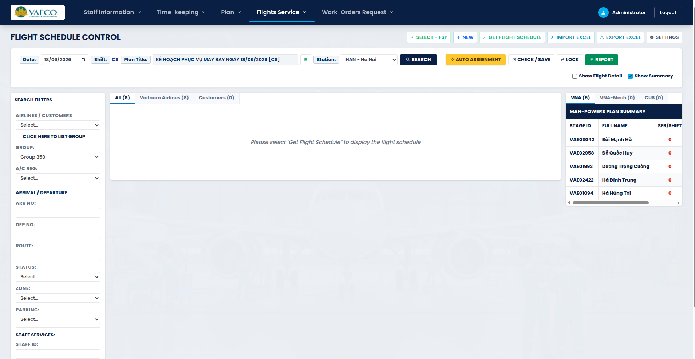
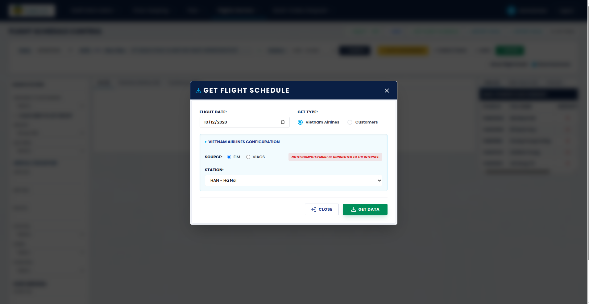
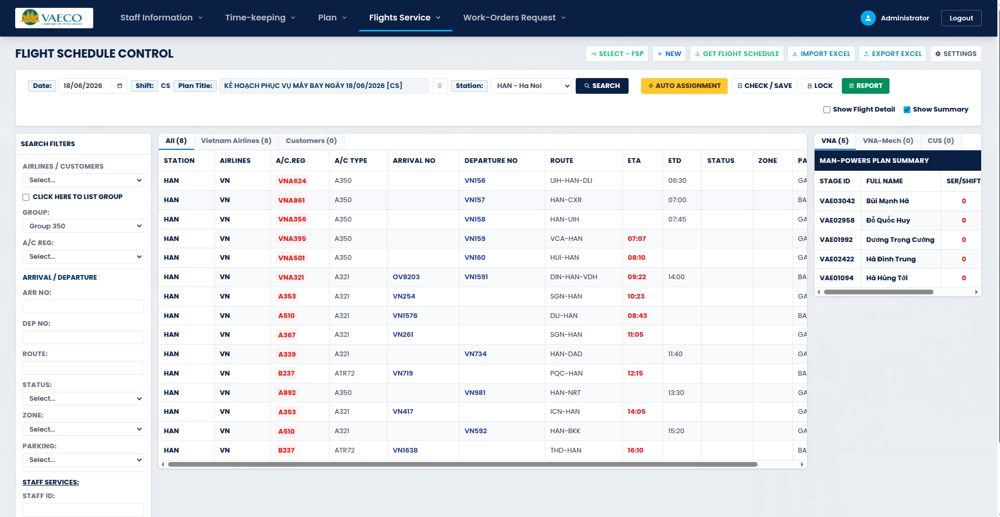

## Màn 7: Chạy Auto Assignment (Nút trên màn Lịch bay)
- **Bước làm:**
    - Nhấn nút Auto Assignment.
    - Step 1 (Time Config): Giữ nguyên các tham số thời gian -> Nhấn Next.
    - Step 2 (Assignment Options): Giữ nguyên các tùy chọn mặc định -> Nhấn Run Assignment.

## Màn 8: Lưu kết quả (/flight-schedule/auto-assignment)
- **Bước làm:** Nhấn nút Save Assignments.
- **Chú ý:** Hệ thống quay về màn Lịch bay, tên của 5 nhân viên đã được gán vào các chuyến bay tương ứng.

## Màn 9: Biểu đồ Timeline (/graphics-time-line)
- **Chú ý:** Kiểm tra trực quan các thanh công việc của nhân viên trên biểu đồ.
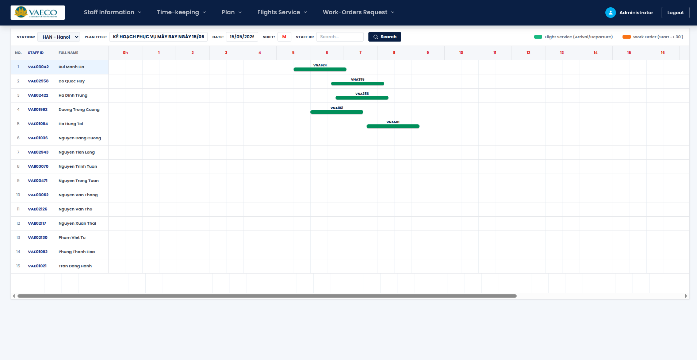

# LUỒNG 2: WORK ORDER (LỆNH SỬA CHỮA)

## Màn 10: Quản lý Work Order (/work-order-control)
- **Bước làm:** Nhấn Download Data -> Xác nhận tải dữ liệu.
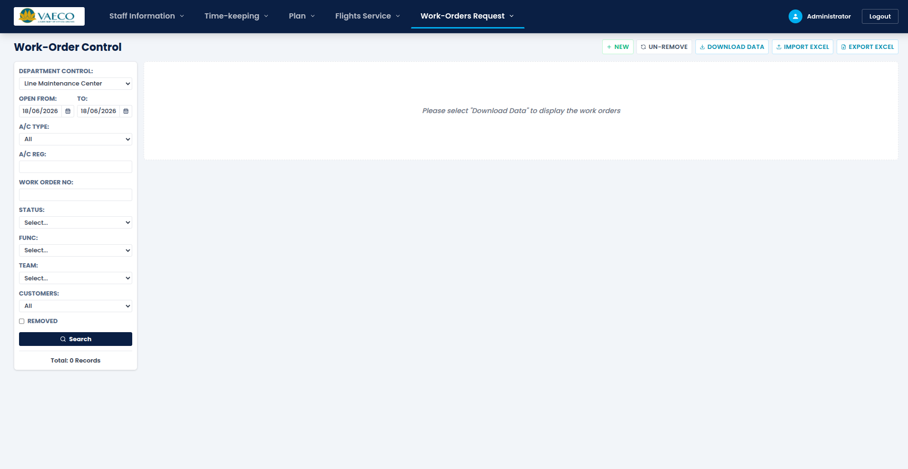
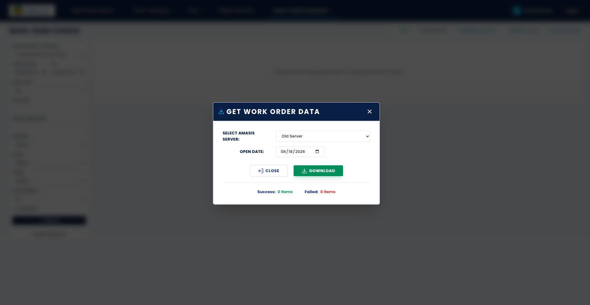
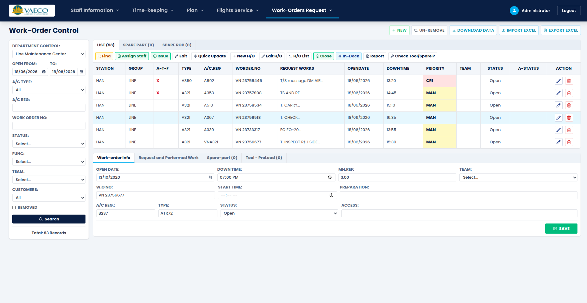

## Màn 11: Gán Work Order (/assign-work-order-to-flight)
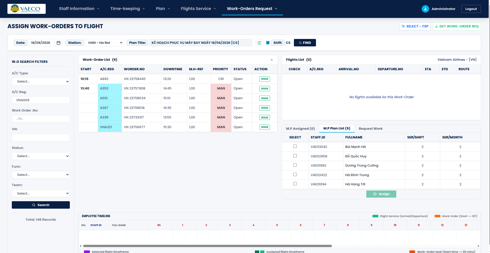
**A. Gán Work Order**
- **Bước làm:**
    - Gán WO 1: Chọn WO đầu tiên -> Chọn chuyến bay -> Chọn Bùi Mạnh Hà -> Nhấn Assign.
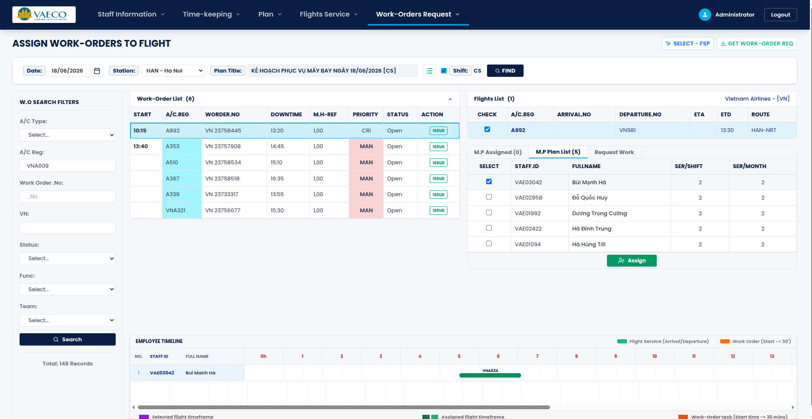
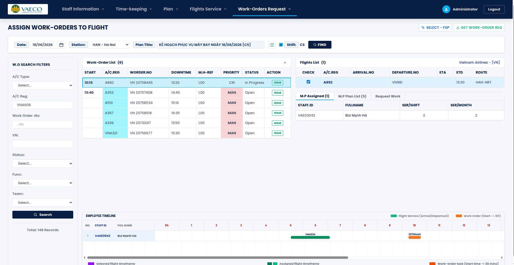
    - Gán WO 2: Tương tự, chọn WO thứ hai -> Chọn chuyến bay -> Chọn Bùi Mạnh Hà -> Nhấn Assign.
**B. Chuyển Work Order sang Issue**
    - Thực hiện chuyển Work Order 3 và 4 sang trạng thái "Issue".
**C. Kết quả cuối cùng**
    - 2 WO đầu tiên được chuyển sang trạng thái "In Progress" và gán cho Bùi Mạnh Hà.
    - 2 WO tiếp theo được chuyển sang trạng thái "Issue".
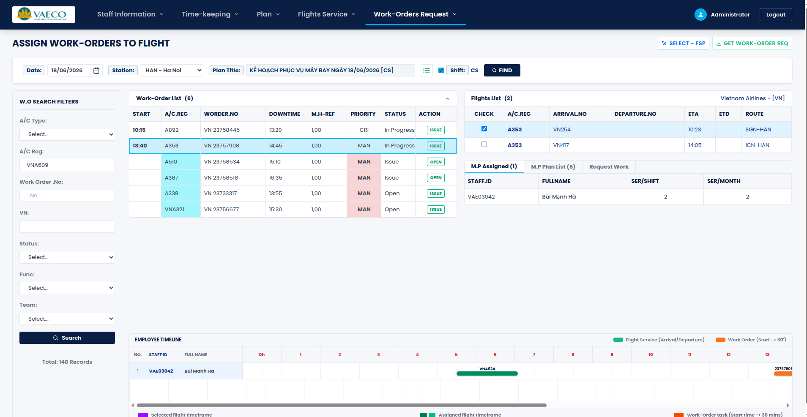

## Màn 12: Dashboard Kỹ thuật viên (/technician-dashboard)
- **Chú ý:** Đăng nhập với tài khoản của Bùi Mạnh Hà, mục IN PROGRESS hiển thị số 02.
- **Bước làm:** Nhấn View All Workorders.
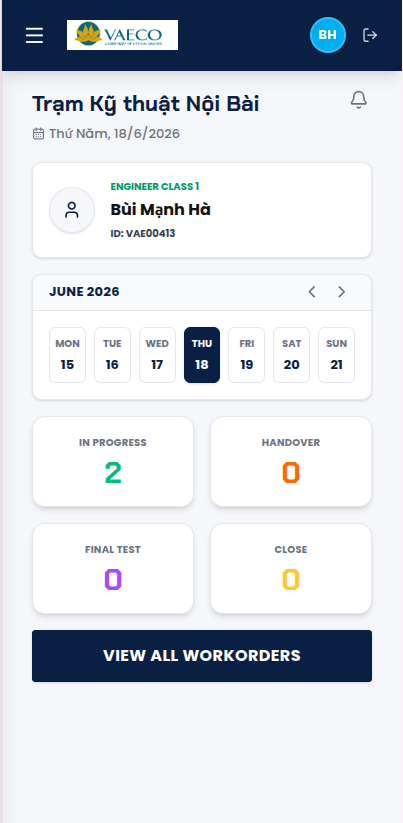

## Màn 13: Danh sách nhiệm vụ (/technician-task-control)
- **Bước làm:**
    - Tại tab **My Task**: Hiển thị 2 WO đã được gán ở Màn 11. Tiến hành cập nhật 1 WO sang trạng thái **"Handover"** và 1 WO sang **"Final Test"**.
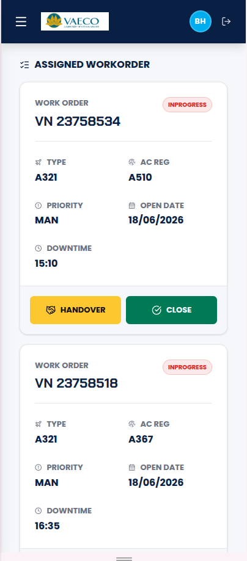
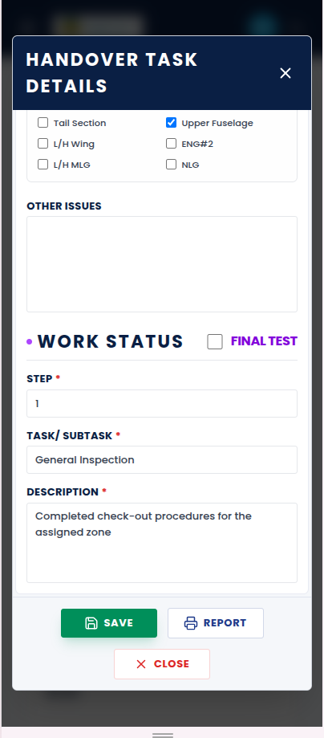

   - Tại tab **Get Task**: Hiển thị các công việc từ Màn 11. Kỹ thuật viên có thể nhấn nút **Accept Task** để nhận các công việc đã được gán.
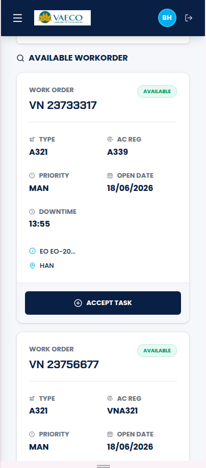

## Màn 14: Theo dõi Work Order (/work-order-in-out)
- **Chú ý:** Danh sách hiển thị 2 Work Order từ Màn 13 với trạng thái là **"Handover"** và **"Final Test"**.
- 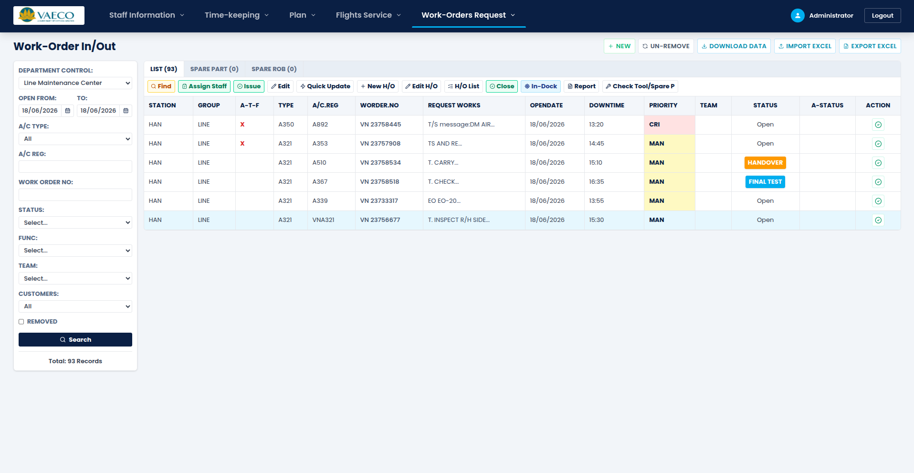